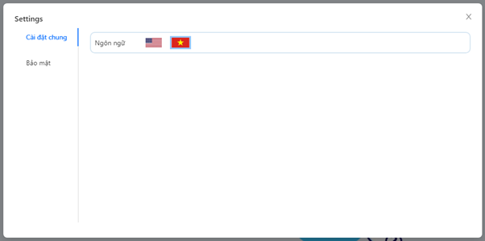

# Chatala

## Project Description:

A website for chatting and make new friends.

Project have all basic features of message app and some features to increase user experience.

### Basic features:
* Login, Register, Forgot Password
* Edit profile
* Find user, add friend, unfriend
* Accept/Decline friend request
* Create group chat, leave group, add member, kick member
* Chat with file
* New message notify
* Realtime event

### Experience enhancement features:
* Use signed key to upload file to cloudinary, use cookie with httpOnly and secure flag for more security
* Reply/Unsend/Emoji message
* Typing animation
* Mention
* Change nickname

---

## Interfaces preview:
* Login  

* Register  

* Home  

* Update Profile  

* File Preview  

* Mention  

* Image Sent  

* File Sent  

* Reply  

* Room Option  

* Image Gallery  

* Setting  

---

## Run project locally

### System requirements:
* Have nodejs installed
* Have access to internet

#### Follow those steps:
1. Clone this project
2. Open two terminal tab, one for backend folder and one for frontend folder of the project.
3. Run `npm i` in both terminal tab.
4. Run `npm run dev` in both terminal tab.
5. Open any browser and access `http://localhost:3000` (or just click on *localhost* link in frontend terminal)

#### Testing account
* Phone: **0919978345** Password: **Thanh123T**
* Phone: **0931199067** Password: **Hung123456**
